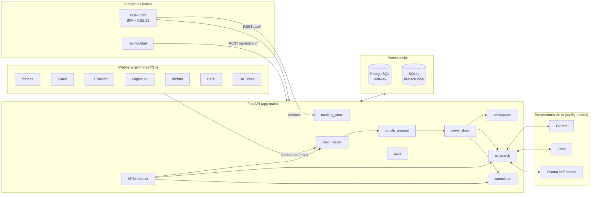
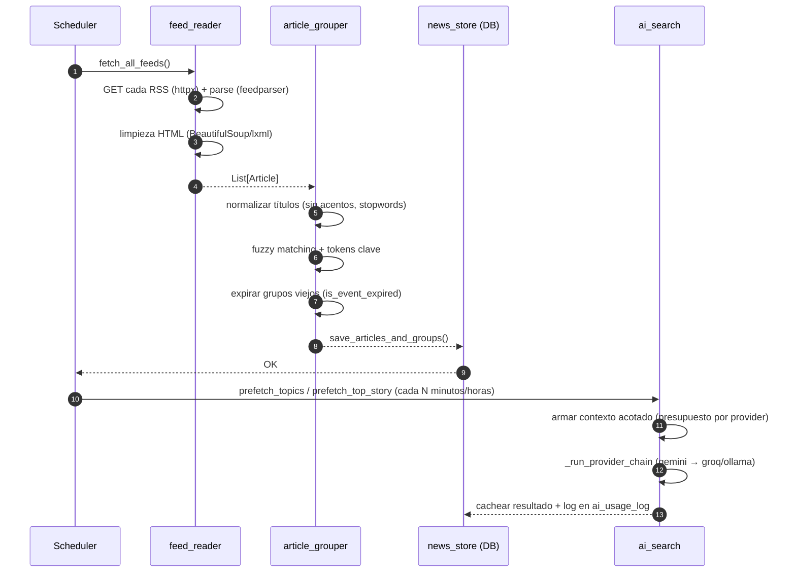

# Vs News — Comparador de Noticias (Argentina)

> **Más contexto, menos relato.** Agrega las noticias de los principales medios argentinos, las agrupa por tema y te muestra cómo cada medio cuenta la misma historia.

<p align="center">
  
  
  
  
  
  
  
  
  
</p>

---

## Tabla de contenidos

- [¿Qué es Vs News?](#qué-es-vs-news)
- [Casos de uso](#casos-de-uso)
- [Arquitectura](#arquitectura)
- [Stack tecnológico](#stack-tecnológico)
- [Fuentes y categorías](#fuentes-y-categorías)
- [Pipeline de procesamiento](#pipeline-de-procesamiento)
- [Proveedores de IA](#proveedores-de-ia)
- [Scheduler y horarios](#scheduler-y-horarios)
- [Modelo de datos](#modelo-de-datos)
- [Autenticación](#autenticación)
- [Panel de administración](#panel-de-administración)
- [API REST](#api-rest)
- [Variables de entorno](#variables-de-entorno)
- [Instalación y ejecución local](#instalación-y-ejecución-local)
- [Tests y calidad](#tests-y-calidad)
- [Deploy en Railway](#deploy-en-railway)
- [Estructura del repositorio](#estructura-del-repositorio)
- [Mantenimiento de la documentación](#mantenimiento-de-la-documentación)
- [Roadmap / Backlog](#roadmap--backlog)
- [Licencia](#licencia)

---

## ¿Qué es Vs News?

**Vs News** es una plataforma web que:

1. **Ingesta** noticias vía feeds RSS de los principales medios argentinos cada pocos minutos.
2. **Agrupa** automáticamente artículos que cubren la misma historia (fuzzy matching sobre títulos).
3. **Compara** la cobertura — títulos, bajadas, foco y diferencias lado a lado entre medios.
4. **Resume** con IA los temas del día, la noticia destacada y un resumen semanal.
5. **Permite buscar** con lenguaje natural (búsqueda semántica sobre los grupos vigentes).
6. **Mide el uso** del producto (eventos anónimos y autenticados) en un panel admin con dashboards de engagement, costos de IA y de infraestructura.

El objetivo es darle al lector herramientas para **contrastar encuadres** en vez de consumir una sola línea editorial.

## Casos de uso

- Abrir la home y ver **qué temas están cubriendo hoy varios medios a la vez** (indicador de "multi-fuente").
- Entrar a un grupo y leer **lado a lado** los títulos/bajadas/imágenes de cada medio.
- Buscar `"inflación abril"` y que la IA devuelva los **grupos más relevantes** con una respuesta sintética.
- Ver la **word cloud** con los términos más repetidos en las últimas 24 h.
- Consultar como admin: usuarios activos, búsquedas más frecuentes, costo acumulado por proveedor de IA, estado de los feeds y de los jobs programados.

---

## Arquitectura



**Ideas clave de diseño:**

- **Sin framework frontend**: HTML + CSS + JS vanilla servidos como estáticos (`static/`), con cache-busting por hash de contenido computado al arrancar (`_compute_asset_hashes` en `app/main.py`).
- **Un solo proceso**: la API FastAPI y el scheduler (`APScheduler`) corren en el mismo `uvicorn` worker. El scheduler vive dentro del `lifespan` (`app/main.py` línea 492+).
- **Persistencia agnóstica**: `app/db.py` detecta `DATABASE_URL` → PostgreSQL; si no está definida, cae a SQLite (`data/metrics.db`). Los SQL usan `?` como placeholder y se traducen a `%s` para Postgres.
- **IA con fallback**: cada evento (`search`, `topics`, `top_story`, `weekly_summary`, `search_prefetch`) arma su propia **cadena ordenada** de hasta 4 proveedores desde el panel admin (ej.: `["gemini", "ollama", "groq"]`). Si un proveedor falla o no está configurado, se pasa al siguiente y se loguea todo en `ai_usage_log`.
- **Admin controlable en caliente**: intervalos del scheduler, ventanas de silencio (quiet hours) para IA, timeout de Ollama, y límites de cuota por proveedor se ajustan desde `/admin` sin redeployar.

---

## Stack tecnológico

| Capa | Tecnología | Dónde vive |
|------|------------|------------|
| Backend | **FastAPI 0.115** + **Uvicorn** | `app/main.py` |
| Scheduling | **APScheduler 3.10** (`AsyncIOScheduler`) | `app/main.py` (lifespan) |
| RSS | **feedparser** + **httpx** | `app/feed_reader.py` |
| Fuzzy matching | **rapidfuzz** | `app/article_grouper.py` |
| Comparador | difflib + heurísticas custom | `app/comparator.py` |
| IA | **google-genai**, **groq**, **httpx** (Ollama) | `app/ai_search.py` |
| ORM / DB | **psycopg2-binary** (PG) / **sqlite3** (stdlib) | `app/db.py` y `*_store.py` |
| Auth | **python-jose** (JWT), **authlib**, **itsdangerous** (magic links) | `app/auth.py` |
| Email | **resend** | `app/auth.py` (magic link) |
| Integración con X | **httpx** + OAuth2 refresh | `app/x_client.py`, `app/x_campaigns.py` |
| Wordcloud PNG | **wordcloud 1.9** + **Pillow 11** | `app/wordcloud.py` |
| Validación | **Pydantic v2** | `app/models.py` |
| Frontend | HTML + CSS + JS vanilla | `static/` |
| Tests | **pytest**, **pytest-asyncio**, **respx** (mock HTTPX), **pytest-cov** | `tests/` |
| CI | GitHub Actions, Python 3.11 y 3.12 | `.github/workflows/test.yml` |
| Deploy | **Railway** (Nixpacks, Postgres, Ollama) | `railway.toml`, `Procfile` |

---

## Fuentes y categorías

Definidas en [`app/config.py`](./app/config.py) (`SOURCES`). Un solo lugar para agregar/quitar medios o feeds.

| Medio | Color | Feeds RSS |
|-------|-------|-----------|
| **Infobae** | `#e63946` | portada, política, economía, sociedad, deportes |
| **Clarín** | `#1a73e8` | portada (`lo-ultimo`), política, economía, sociedad, deportes |
| **La Nación** | `#2d6a4f` | portada, política, economía, sociedad, deportes |
| **Página 12** | `#e76f51` | portada, política (el país), economía, sociedad, deportes |
| **Ámbito Financiero** | `#f4a261` | portada (home), política, economía, sociedad (nacional), deportes |
| **Perfil** | `#7209b7` | portada, política, economía, sociedad, deportes |
| **Buenos Aires Times** | `#3a86a8` | portada |

> Infobae expone ediciones internacionales en el mismo feed; se filtran con `exclude_link_re` (`/mexico/`, `/colombia/`, `/espana/`, `/peru/`, `/centroamerica/`, `/venezuela/`).

**Categorías soportadas:** `portada`, `politica`, `economia`, `sociedad`, `deportes` (constante `CATEGORIES`).

**Parámetros relevantes:**

| Constante | Valor por defecto | Significado |
|-----------|-------------------|-------------|
| `SIMILARITY_THRESHOLD` | `55` | Score mínimo (0–100) para agrupar dos titulares con rapidfuzz. |
| `MAX_ARTICLES_PER_FEED` | `30` | Tope de artículos leídos por feed y corrida. |
| `FETCH_TIMEOUT` | `15` s | Timeout HTTP para leer cada feed. |
| `USER_AGENT` | Chrome/131 | UA que mandamos al hacer GET de los RSS. |

---

## Pipeline de procesamiento



**Detalles:**

1. `fetch_all_feeds()` lee todos los RSS en paralelo con `httpx.AsyncClient`, enviando un UA real para evitar bloqueos.
2. `group_articles()` en `app/article_grouper.py` normaliza el título (`_normalize`: lower + sin acentos + sin stopwords + sin nombres de meses/fechas/días), extrae tokens clave y usa `rapidfuzz.fuzz.token_set_ratio` contra representantes de grupos vigentes.
3. Los grupos se persisten en la tabla `article_groups` (con su título representativo y categoría) y los artículos en `articles` (`app/news_store.py`).
4. Un grupo "expira" cuando pasa el tiempo definido en `is_event_expired` (basado en el `published` del artículo más reciente del grupo) y deja de competir por nuevos matches.
5. El endpoint `/api/comparar/{id}` arma una comparación detallada con `compare_group_articles` (diff de títulos/resúmenes, cobertura de cada fuente).

---

## Proveedores de IA

Soportamos **tres** proveedores (`app/ai_search.py`) y cada evento arma su propia cadena ordenada con los valores simples de `app.ai_store.VALID_PROVIDERS`:

| Proveedor | Modelo por defecto | Costo | Contexto útil | Uso recomendado |
|-----------|-------------------|-------|---------------|-----------------|
| **Gemini** | `gemini-3-flash-preview` | Pago (USD 0.50 / 3.00 por 1M tokens in/out) | 100k+ tokens | Primario — maneja contexto grande y JSON por prompt |
| **Groq** | `llama-3.3-70b-versatile` | Free tier generoso | ~10k chars (`GROQ_MAX_PROMPT_CHARS`) | Fallback rápido — fuerza JSON con `response_format` |
| **Ollama** | `qwen3:8b` (override con `OLLAMA_MODEL`) | Self-hosted (0 USD por token) | ~12k chars (`OLLAMA_MAX_PROMPT_CHARS`) | Fallback sin salida a internet; ideal para Railway interno |

**Proveedores válidos** (`VALID_PROVIDERS`): `gemini`, `groq`, `ollama`. Cada evento guarda en `ai_provider_config.provider` una **lista JSON ordenada** sin duplicados y de hasta `MAX_PROVIDER_CHAIN = 4` entradas (ej.: `["gemini"]`, `["gemini","groq"]`, `["ollama","gemini","groq"]`). Los valores legacy del formato `X_fallback_Y` se parsean en lectura para compatibilidad hacia atrás.

**Eventos** (`VALID_EVENT_TYPES`): `search`, `search_prefetch`, `topics`, `weekly_summary`, `top_story`.

**Mecanismos de control** (todos modificables desde `/admin` sin redeploy):

- **Cadena de providers por evento** (`ai_provider_config`): panel con 4 combos ordenados por evento (1ro / 2do / 3ro / 4to); cada slot excluye los proveedores ya elegidos en slots anteriores.
- **Cuotas por proveedor** (`ai_provider_limits`): RPM, TPM, RPD, TPD. Si se exceden, `_run_provider_chain` salta al siguiente de la cadena y lo loguea.
- **Quiet hours** (`ai_schedule_config`): ventana horaria por evento (zona horaria ART) en la que no se corre IA. Útil para apagar prefetch de madrugada.
- **Timeout de Ollama** (`OLLAMA_TIMEOUT_MIN=30` / `MAX=900`, default 120 s): se lee en cada invocación desde `get_ollama_timeout()`. La primera llamada tras idle puede tardar 15–40 s (cold start del modelo); mantené `OLLAMA_KEEP_ALIVE=10m` en el servicio.
- **Logging de prompts** (`AI_LOG_PREVIEWS=1`): guarda prompt/respuesta completos en `ai_usage_log`. Los fallos de Ollama persisten el preview **siempre**, para poder debuggear post-mortem.

> Para los criterios al tocar prompts, límites de contexto y timeouts, ver la regla [`/.cursor/rules/ai-providers.mdc`](./.cursor/rules/ai-providers.mdc).

---

## Scheduler y horarios

El scheduler arranca en el `lifespan` de FastAPI (`app/main.py` línea 492+). Todos los intervalos marcados como *configurables* se leen de `ai_scheduler_config` y se pueden cambiar desde el panel admin en vivo.

| Job | Trigger | Default | Configurable | Acción |
|-----|---------|---------|--------------|--------|
| `refresh_news` | `interval` | cada **10 min** | sí | Lee todos los RSS, agrupa y persiste. |
| `refresh_wordcloud` | `interval` | cada **2 h** | no | Recalcula términos frecuentes (últimas 24 h). |
| `prefetch_top_story` | `interval` | cada **3 h** | no | Pide a la IA la noticia destacada del día y la cachea. |
| `prefetch_topics` | `interval` | cada **30 min** | sí | Arma los "Temas del día" (IA, cacheado). |
| `prefetch_weekly_summary` | `cron` | **09:15** y **18:00** (ART) | no | Resumen semanal (lunes–hoy). |
| `purge_old_news` | `cron` | **07:00** (ART) | no | Limpia noticias y grupos vencidos. |
| `purge_old_events` | `cron` | **06:30** (ART) | no | Purga eventos de tracking viejos. |
| `purge_old_process_events` | `cron` | **06:45** (ART) | no | Limpia `process_events` (logs de jobs). |
| `refresh_infra_costs` | `interval` | cada **1 h** | no | (Solo si `RAILWAY_API_TOKEN` está seteado) consulta costo por servicio a Railway GraphQL. |
| `purge_infra_snapshots` | `cron` | **07:15** (ART) | no | Limpia snapshots viejos de infra. |
| `x_campaign_cloud` | `cron` | configurable | sí | (Si `cloud` está activa) postea la nube del día en X. |
| `x_campaign_topstory` | `cron` | configurable | sí | (Si `topstory` está activa) postea la noticia del día en X. |
| `x_campaign_weekly` | `cron` | configurable (día + hora) | sí | (Si `weekly` está activa) postea el resumen semanal (hilo). |
| `x_campaign_topics` | `cron` | configurable | sí | (Si `topics` está activa) postea los temas del día (hilo). |
| `purge_x_usage` | `cron` | **07:30** (ART) | no | Limpia `x_usage_log` con más de 90 días. |

La campaña `breaking` **no agenda un cron**: se dispara reactivamente al final de cada `refresh_news` cuando aparece un grupo multi-fuente que cumple los criterios (`min_source_count`, categorías permitidas, cooldown).

Al arrancar también se dispara un `refresh_news()` inmediato y un **startup prefetch** de IA (si hay credenciales). Todas las corridas se loguean en `process_events` con `component`/`event_type`/`status` y se pueden consultar desde `/api/admin/process-events`.

---

## Modelo de datos

Modelos Pydantic en `app/models.py`:

```python
class Article(BaseModel):
    id: str
    source: str
    source_color: str
    title: str
    summary: str
    link: str
    image: str
    category: str  # portada | politica | economia | sociedad | deportes
    published: datetime | None

class ArticleGroup(BaseModel):
    group_id: str
    representative_title: str
    representative_image: str
    category: str
    published: datetime | None
    articles: list[Article]
    source_count: int  # se computa post-init
```

**Tablas** (inicializadas en el `lifespan`):

| Tabla | Módulo | Qué guarda |
|-------|--------|------------|
| `articles`, `article_groups` | `app/news_store.py` | Noticias + grupos vigentes. |
| `group_metrics` | `app/metrics_store.py` | Snapshots diarios de cuántas fuentes cubrieron qué. |
| `users` | `app/user_store.py` | Usuarios (id, email, role, provider, created_at). |
| `tracking_events` | `app/tracking_store.py` | Eventos del frontend (clicks, búsquedas, vistas, etc.). |
| `ai_usage_log`, `ai_runtime_config`, `ai_provider_limits`, `ai_schedule_config`, `ai_topics_cache`, `ai_topstory_cache` | `app/ai_store.py` | Uso, costo y configuración de IA. |
| `process_events` | `app/process_events_store.py` | Log estructurado de jobs del scheduler. |
| `infra_cost_snapshots` | `app/infra_cost_store.py` | Costo por servicio traído de Railway. |
| `x_campaigns`, `x_tier_config`, `x_oauth_state`, `x_usage_log` | `app/x_store.py` | Config de campañas de X, tier contratado, tokens OAuth2 vigentes y log de posteos. |

**Pricing de IA** en `MODEL_PRICING` (`app/ai_store.py`). Groq y Ollama cuestan 0 USD/token; Gemini tiene precios por 1M tokens input/output y se persiste el cálculo en `ai_usage_log.cost_total`.

---

## Autenticación

Toda la lógica en [`app/auth.py`](./app/auth.py). Sesión por **JWT** guardado en una cookie `vs_token` (HTTPOnly, `SameSite=Lax`, `Secure` si `BASE_URL` es HTTPS).

| Mecanismo | Ruta | Requisitos |
|-----------|------|------------|
| **Google OAuth** | `GET /auth/google/login` → `GET /auth/google/callback` | `GOOGLE_CLIENT_ID`, `GOOGLE_CLIENT_SECRET`, `BASE_URL` |
| **Magic link** | `POST /auth/magic/request` → `GET /auth/magic/verify?token=...` | `RESEND_API_KEY` (sin clave, el link se loguea — modo dev) |
| **Sesión actual** | `GET /auth/me` | cookie válida (renueva ventana) |
| **Logout** | `POST /auth/logout` | — |

**Roles:** los emails listados en `ADMIN_EMAILS` (env var separada por comas) reciben `role="admin"` al hacer login. Todo lo demás queda como `role="user"`.

**JWT config** (`app/config.py`):

- `JWT_SECRET` (obligatorio en producción).
- `JWT_ALGORITHM = "HS256"`.
- `JWT_EXPIRE_HOURS = 24 * 365` (ventana deslizante renovada en cada `/auth/me`).
- `MAGIC_LINK_MAX_AGE = 15 * 60` (15 min, firmado con `itsdangerous`).

---

## Panel de administración

Disponible en **`/admin`** (requiere JWT + rol `admin`). Sirve el archivo `static/admin.html` y se alimenta de los endpoints `/api/admin/*`.

**Secciones principales:**

- **Dashboard**: usuarios activos, eventos por hora, actividad diaria, secciones visitadas, búsquedas populares, contenido top.
- **AI Monitor**: últimas invocaciones a IA (tokens, latencia, error, proveedor), con drill-down al prompt/respuesta si está habilitado `AI_LOG_PREVIEWS`.
- **AI Config**: cambiar el provider por evento, ajustar cuotas RPM/TPM/RPD/TPD, definir quiet hours por evento, cambiar el timeout de Ollama.
- **AI Cost**: costo diario total y por proveedor.
- **Scheduler Config**: ajustar intervalos de `refresh_news` y `prefetch_topics` en vivo.
- **Process Events**: log de jobs del scheduler (inicio, fin, error, duración).
- **Infra Costs**: snapshot de consumo por servicio en Railway (requiere token).
- **Ollama Logs**: últimas líneas del container de Ollama traídas vía Railway GraphQL (requiere `RAILWAY_OLLAMA_SERVICE_NAME`, default `ollama`).
- **Debug Headers / Purga de proxies**: utilidades para limpiar eventos con IPs de proxy que contaminan las métricas de visitantes anónimos.
- **Campañas X**: configurar la integración con X (ex-Twitter). Una card "Cuenta y cupo" muestra el handle conectado, el tier contratado (Apagado/Basic/Pro/Pay per Use) y los caps diarios/mensuales con barras de progreso. Cinco cards (una por tipo de campaña) permiten habilitarlas, elegir hora/día de posteo, editar la plantilla del tweet, y probar el runner con el botón "Probar ahora". Ver la sección específica más abajo.

### Campañas X

La tab **Campañas X** controla los 5 tipos de publicaciones automáticas:

| Campaña | Trigger | Descripción |
|---------|---------|-------------|
| `cloud` (Nube del día) | cron diario | Renderiza la nube de palabras como PNG (vía `wordcloud` + Pillow), la sube a X y la postea con el listado top. |
| `topstory` (Noticia del día) | cron diario | Tweet con título + link a la historia más cubierta del día (usa el cache de `ai_top_story`). |
| `weekly` (Resumen semanal) | cron semanal (día + hora) | Hilo corto con los temas editoriales de la semana (reutiliza `ai_weekly_summary`). |
| `topics` (Temas del día) | cron diario | Hilo con los trending topics detectados (reutiliza `ai_topics`). |
| `breaking` (Breaking news) | reactivo (post-`refresh_news`) | Tweet puntual cuando aparece un grupo con ≥ `min_source_count` fuentes en las categorías permitidas y pasó el cooldown. |

El tier (`Apagado` / `Basic` / `Pro` / `Pay per Use`) pre-carga caps típicos de X Developer Portal pero siempre se pueden editar manualmente en `Pay per Use` (billing por request, ~USD 0.01 por tweet según X). `Apagado` es el kill-switch interno: fuerza caps a 0, desactiva todas las campañas, y es el estado por defecto al arrancar. Los posteos se persisten en `x_usage_log` y los tokens OAuth2 renovados en `x_oauth_state` (sobreviven a redeploys).

> **Migración**: instalaciones previas con tier `custom` o `free` se renombran automáticamente a `pay_per_use` y `disabled` respectivamente al inicializar las tablas (`init_x_tables` corre `UPDATE x_tier_config SET tier = '<nuevo>' WHERE tier = '<viejo>'`). Los aliases legacy también se aceptan en `set_tier_config(...)` para scripts/tests que los sigan usando.

---

## API REST

Base URL: `http://localhost:8000` (local) o el dominio de Railway (prod).

### Noticias y comparación

| Endpoint | Método | Params | Descripción |
|----------|--------|--------|-------------|
| `/api/noticias` | GET | `categoria`, `fuente`, `limit`, `offset` | Listado plano de artículos vigentes. |
| `/api/grupos` | GET | `categoria`, `solo_multifuente`, `desde`, `hasta`, `limit`, `offset` | Grupos de artículos (historias). |
| `/api/grupo/{id}` | GET | — | Detalle de un grupo. |
| `/api/comparar/{id}` | GET | — | Comparación lado a lado con diff. |
| `/api/fuentes` | GET | — | Fuentes con color/logo/categorías soportadas. |
| `/api/categorias` | GET | — | Lista de categorías. |
| `/api/status` | GET | `desde`, `hasta` | Estado de feeds + totales. |
| `/api/metricas` | GET | `desde`, `hasta` | Métricas históricas de agenda. |
| `/api/refresh` | POST | — | Fuerza una corrida de `refresh_news`. |

### IA y derivados

| Endpoint | Método | Descripción |
|----------|--------|-------------|
| `/api/search` | GET (`q`) | Búsqueda asistida por IA con el grupo más relevante como respuesta. |
| `/api/topics` | GET | Temas del día (cacheados). |
| `/api/weekly-range` | GET | Rango `lunes → hoy` en ART. |
| `/api/weekly-summary` | GET | Resumen semanal (IA). |
| `/api/top-story` | GET | Noticia destacada del día (IA, cacheada). |
| `/api/wordcloud` | GET | Términos frecuentes (últimas 24 h). |
| `/api/ai-config` | GET | Config pública (modelo activo por evento). |

### Tracking

| Endpoint | Método | Descripción |
|----------|--------|-------------|
| `/api/track` | POST | Lote de eventos del frontend (autenticado o anónimo). |

### Admin (requiere rol `admin`)

| Endpoint | Método | Descripción |
|----------|--------|-------------|
| `/api/admin/dashboard` | GET | Resumen de uso y engagement. |
| `/api/admin/users` | GET | Listado de usuarios. |
| `/api/admin/popular-searches` | GET | Búsquedas más frecuentes. |
| `/api/admin/top-content` | GET | Contenido más visto. |
| `/api/admin/daily-activity` | GET | Actividad por día. |
| `/api/admin/hourly` | GET | Distribución horaria. |
| `/api/admin/anonymous` | GET | Métricas de visitantes anónimos. |
| `/api/admin/debug-headers` | GET | Cabeceras / IP detectada (debug). |
| `/api/admin/purge-proxy-events` | POST | Borra eventos cuya IP es de un proxy. |
| `/api/admin/ai-cost` | GET | Costo acumulado por proveedor/día. |
| `/api/admin/ai-config` | GET / POST | Cadena ordenada de providers por evento (hasta 4 entradas). |
| `/api/admin/ai-schedule` | POST | Quiet hours por evento. |
| `/api/admin/ai-limits` | GET / POST | Cuotas RPM/TPM/RPD/TPD por proveedor. |
| `/api/admin/ai-monitor` | GET | Últimas invocaciones. |
| `/api/admin/ai-invocations` | GET | Búsqueda paginada de invocaciones. |
| `/api/admin/ollama-config` | GET / POST | Timeout de invocación Ollama. |
| `/api/admin/ollama-logs` | GET | Logs del container de Ollama (Railway). |
| `/api/admin/scheduler-config` | GET / POST | Intervalos de jobs en vivo. |
| `/api/admin/process-events` | GET | Log de jobs. |
| `/api/admin/infra-costs` | GET / POST `…/refresh` | Snapshots de costo de infra. |
| `/api/admin/x-status` | GET | `is_configured`, handle conectado, último refresh, tier actual, caps y totales `today`/`month`. |
| `/api/admin/x-refresh-handle` | POST | Fuerza un `GET /2/users/me` para refrescar el handle cacheado. |
| `/api/admin/x-campaigns` | GET / POST | Config de las 5 campañas (`enabled`, schedule, template, opciones). Valida y re-agenda jobs. |
| `/api/admin/x-tier` | GET / POST | Tier contratado y caps. `disabled` (antes `free`) es kill-switch y apaga todas las campañas; `basic`/`pro` pre-cargan defaults; `pay_per_use` (antes `custom`) acepta lo que pase el admin. |
| `/api/admin/x-usage` | GET | Log paginado de posteos (`ok`/`error`/`rate_limited`/`quota_exceeded`/`disabled_by_tier`). |
| `/api/admin/x-test-post` | POST | Ejecuta el runner de una campaña puntual (respeta caps) para validar plantillas y tokens. |

### Auth (prefijo `/auth`)

`/auth/google/login`, `/auth/google/callback`, `/auth/magic/request`, `/auth/magic/verify`, `/auth/me`, `/auth/logout`.

### Otros

| Endpoint | Método | Descripción |
|----------|--------|-------------|
| `/health` | GET | Healthcheck (usado por Railway, ver `railway.toml`). |
| `/` | GET | SPA principal (`index.html`). |
| `/admin` | GET | Panel admin (HTML). |
| `/privacy`, `/terms` | GET | Páginas estáticas. |

> La documentación interactiva OpenAPI queda deshabilitada por defecto en producción. Se puede habilitar pasando `docs_url=...` al constructor de `FastAPI` en `app/main.py` si hace falta.

---

## Variables de entorno

**Obligatorias en producción:**

| Variable | Uso |
|----------|-----|
| `JWT_SECRET` | Firma de los JWT (¡no dejar el default `dev-secret-change-me`!). |
| `BASE_URL` | URL pública (ej. `https://vsnews.app`). Determina `redirect_uri` de Google y `Secure` de la cookie. |
| `DATABASE_URL` | Connection string Postgres. Si falta, cae a SQLite (`data/metrics.db`). |

**Opcionales pero frecuentes:**

| Variable | Uso |
|----------|-----|
| `ADMIN_EMAILS` | Lista separada por comas; reciben `role="admin"` al logearse. |
| `GEMINI_API_KEY` | Habilita Gemini. |
| `GROQ_API_KEY` | Habilita Groq. |
| `OLLAMA_BASE_URL` | Habilita Ollama (ej. `http://ollama.railway.internal:11434`). |
| `OLLAMA_MODEL` | Modelo Ollama (default `qwen3:8b`). |
| `OLLAMA_KEEP_ALIVE` | Recomendado `10m` para evitar cold starts del modelo. |
| `AI_LOG_PREVIEWS` | `1` para persistir prompts/respuestas completos en `ai_usage_log`. |
| `GOOGLE_CLIENT_ID`, `GOOGLE_CLIENT_SECRET` | Para Google OAuth. |
| `RESEND_API_KEY` | Envía magic links por email. Sin esto, el link sale por log (modo dev). |
| `RAILWAY_API_TOKEN`, `RAILWAY_PROJECT_ID` | Habilita el panel de costos y logs de Ollama en `/admin`. |
| `RAILWAY_OLLAMA_SERVICE_NAME` | Nombre del servicio de Ollama en Railway (default `ollama`). |
| `TWITTER_CLIENT_ID`, `TWITTER_CLIENT_SECRET` | App de X (OAuth2). Obligatorias para renovar tokens automáticamente. |
| `TWITTER_ACCESS_TOKEN`, `TWITTER_REFRESH_TOKEN` | Bootstrap inicial de tokens OAuth2. Los valores rotados se persisten en `x_oauth_state` — no hace falta reeditar la env var tras el primer refresh. |
| `TWITTER_ACCOUNT_HANDLE` | Opcional. Handle por defecto (sólo display), se sobreescribe al consultar `GET /2/users/me`. |
| `TWITTER_API_BASE`, `TWITTER_UPLOAD_BASE` | Opcionales. Override de los endpoints base (útil para tests/mocks). |
| `PORT` | Lo setea Railway. `Procfile` usa `${PORT:-8080}`. |

Ejemplo de `.env` mínimo para desarrollo:

```bash
JWT_SECRET=cambia-esto
BASE_URL=http://localhost:8000
GEMINI_API_KEY=...           # opcional
GROQ_API_KEY=...             # opcional (fallback)
ADMIN_EMAILS=vos@example.com
```

---

## Instalación y ejecución local

**Requisitos:** Python **3.11+** (probado en 3.11 y 3.12 en CI).

```bash
git clone https://github.com/arielbrizi/ComparadorNoticias.git
cd ComparadorNoticias

python -m venv .venv
. .venv/Scripts/activate          # Windows (PowerShell: .\.venv\Scripts\Activate.ps1)
# source .venv/bin/activate       # macOS/Linux

pip install -r requirements.txt
pip install -r requirements-dev.txt   # si vas a correr tests

cp .env.example .env              # si existe; si no, creá uno con JWT_SECRET y BASE_URL
uvicorn app.main:app --reload --host 0.0.0.0 --port 8000
```

Abrí [http://localhost:8000](http://localhost:8000). Panel admin: [http://localhost:8000/admin](http://localhost:8000/admin) (solo emails en `ADMIN_EMAILS`).

Sin `DATABASE_URL` la base se crea en `data/metrics.db` (SQLite, modo WAL).

---

## Tests y calidad

Suite con **pytest**:

```bash
python -m pytest --tb=short -q
python -m pytest --cov=app --cov-report=term-missing   # con cobertura
python -m pytest tests/unit/test_ai_search.py -q        # un módulo
```

**Estructura:**

- `tests/unit/` — lógica pura, sin I/O (fuzzy matching, comparator, modelos, search utils, ai_search, etc.).
- `tests/integration/` — API + DB. Usan la fixture `temp_db` de `tests/conftest.py` para una base efímera.
- `tests/fixtures/` — RSS de ejemplo para `feed_reader`.

**Convenciones** (ver [`.cursor/rules/run-tests.mdc`](./.cursor/rules/run-tests.mdc)):

- Todo cambio de código corre la suite antes de cerrar el task.
- Nueva funcionalidad → nuevo test.
- **Nunca** se borran tests para "hacer pasar el CI".

**CI:** GitHub Actions (`.github/workflows/test.yml`) corre pytest contra Python 3.11 y 3.12 en cada push/PR a `master`.

---

## Deploy en Railway

El repo está listo para desplegar en Railway con **Nixpacks**:

- [`Procfile`](./Procfile) — `web: uvicorn app.main:app --host 0.0.0.0 --port ${PORT:-8080}`.
- [`railway.toml`](./railway.toml) — builder Nixpacks, healthcheck en `/health` (120 s), restart `on_failure` hasta 3 veces.

**Servicios típicos del proyecto:**

1. **App** (este repo).
2. **Postgres** (Railway add-on) → exponé `DATABASE_URL`.
3. **Ollama** (imagen `ollama/ollama`) → exponé `OLLAMA_BASE_URL` interno y seteá `OLLAMA_KEEP_ALIVE=10m`.

**Variables a configurar en Railway:** todas las de la sección [Variables de entorno](#variables-de-entorno). Además `RAILWAY_API_TOKEN` y `RAILWAY_PROJECT_ID` si querés los paneles de costo y logs de Ollama.

---

## Estructura del repositorio

```
ComparadorNoticias/
├── app/
│   ├── main.py                 # FastAPI, scheduler, ~50 endpoints
│   ├── config.py               # Fuentes RSS, auth, categorías, constantes
│   ├── models.py               # Pydantic: Article, ArticleGroup, FeedStatus
│   ├── db.py                   # get_conn / query / execute — PG ↔ SQLite
│   ├── auth.py                 # JWT, Google OAuth, magic links
│   ├── user_store.py           # Tabla users
│   ├── feed_reader.py          # Lectura de RSS (httpx + feedparser)
│   ├── article_grouper.py      # Fuzzy matching + expiración de grupos
│   ├── comparator.py           # Comparación lado a lado de un grupo
│   ├── news_store.py           # Persistencia de articles/article_groups
│   ├── metrics_store.py        # Métricas de agenda
│   ├── tracking_store.py       # Eventos del frontend + queries anónimas
│   ├── process_events_store.py # Log estructurado de jobs del scheduler
│   ├── wordcloud.py            # Términos frecuentes
│   ├── search_utils.py         # Keywords, normalización, prioridad
│   ├── ai_search.py            # Gemini / Groq / Ollama + provider chain
│   ├── ai_store.py             # Config de IA, cuotas, quiet hours, costo
│   ├── infra_cost_store.py     # Snapshots de costo de Railway
│   ├── railway_client.py       # Cliente GraphQL de Railway
│   ├── x_client.py             # Cliente OAuth2 de X API v2 (auto-refresh)
│   ├── x_store.py              # Config de campañas, tier, tokens y usage log de X
│   └── x_campaigns.py          # Runners de las 5 campañas de X
├── static/
│   ├── index.html              # SPA pública
│   ├── admin.html              # Panel admin
│   ├── privacy.html, terms.html
│   ├── css/                    # Hojas de estilo
│   └── js/                     # Lógica cliente (vanilla)
├── tests/
│   ├── unit/                   # Tests rápidos, sin I/O
│   ├── integration/            # Tests con DB/API
│   ├── fixtures/               # RSS XML de ejemplo
│   └── conftest.py             # Fixtures compartidas
├── .github/workflows/test.yml  # CI: pytest en 3.11 y 3.12
├── .cursor/rules/              # Reglas del agente (testing, AI, docs)
├── data/metrics.db             # SQLite local (gitignored)
├── pyproject.toml              # Config de pytest
├── requirements.txt
├── requirements-dev.txt
├── Procfile                    # Comando Railway
├── railway.toml                # Builder + healthcheck
├── BACKLOG.md                  # Roadmap
└── README.md                   # Este archivo
```

---

## Mantenimiento de la documentación

Este README es la **fuente de verdad pública** del proyecto y debe mantenerse sincronizado con el código. Cada vez que se cambia código relevante (endpoints, fuentes, variables de entorno, scheduler, IA, dependencias) hay que actualizar este archivo en el mismo push.

La regla [`.cursor/rules/update-docs.mdc`](./.cursor/rules/update-docs.mdc) formaliza ese protocolo para el agente de Cursor: antes de cerrar un cambio que vaya a pushearse, se revisa si el README (y, si corresponde, `BACKLOG.md` o reglas relacionadas) necesita ajustarse.

---

## Roadmap / Backlog

Ver [`BACKLOG.md`](./BACKLOG.md). Próximos ejes:

- Más fuentes (newsletters, medios regionales).
- Integración con X (ingesta o compartir).
- Búsqueda full-text nativa (Postgres FTS) como complemento a la IA.
- PWA y modo offline.
- Robustez del agrupador en casos límite.
- Backups automáticos y healthchecks más ricos.

---

## Licencia

Proyecto personal. Si querés reutilizarlo, abrí un issue o contactame.
